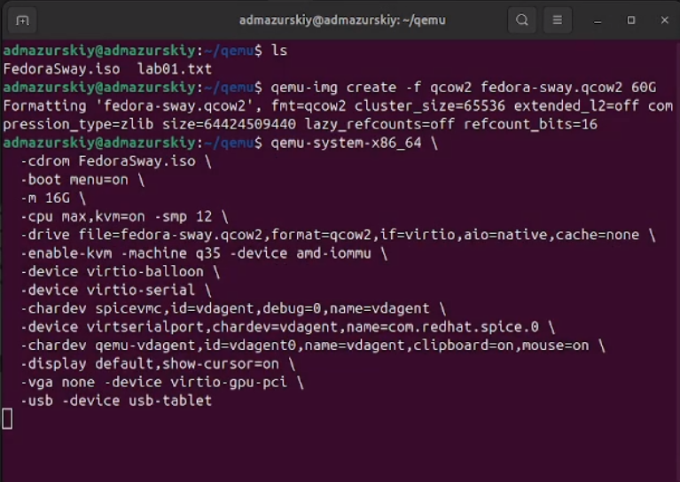
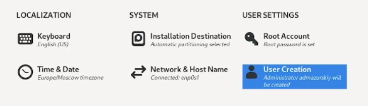
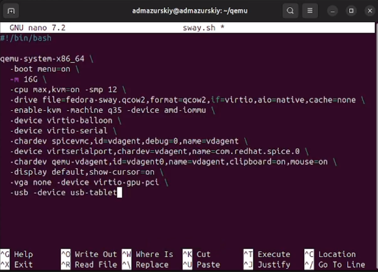
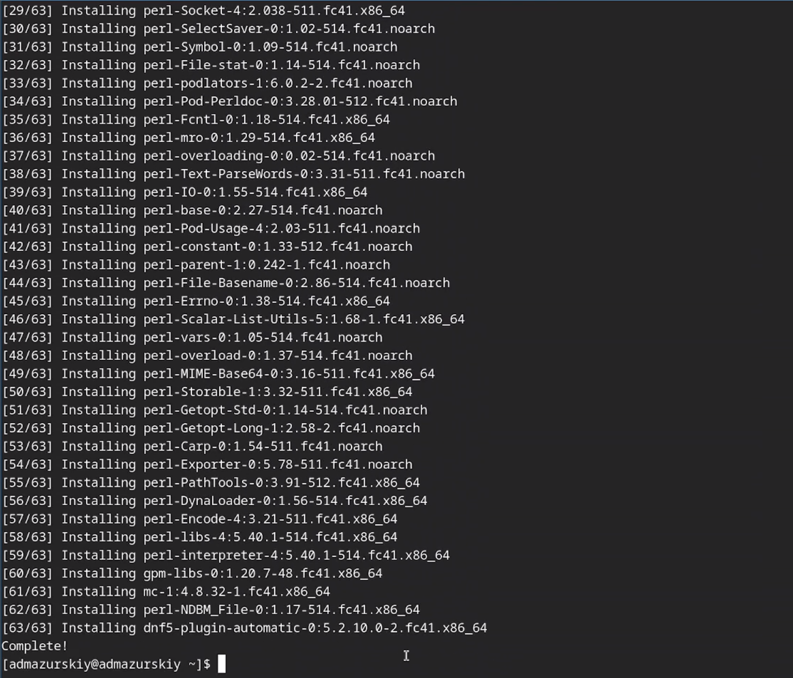
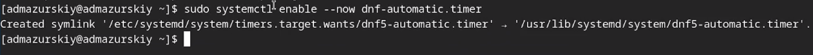
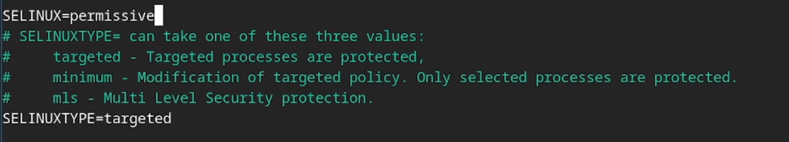
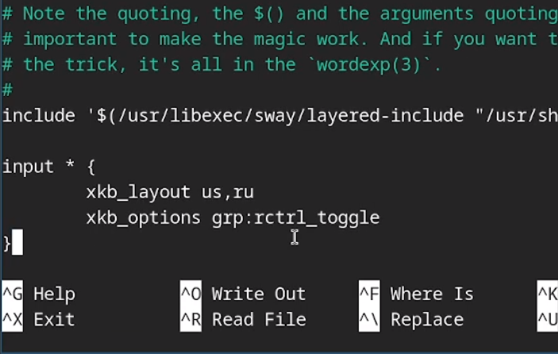
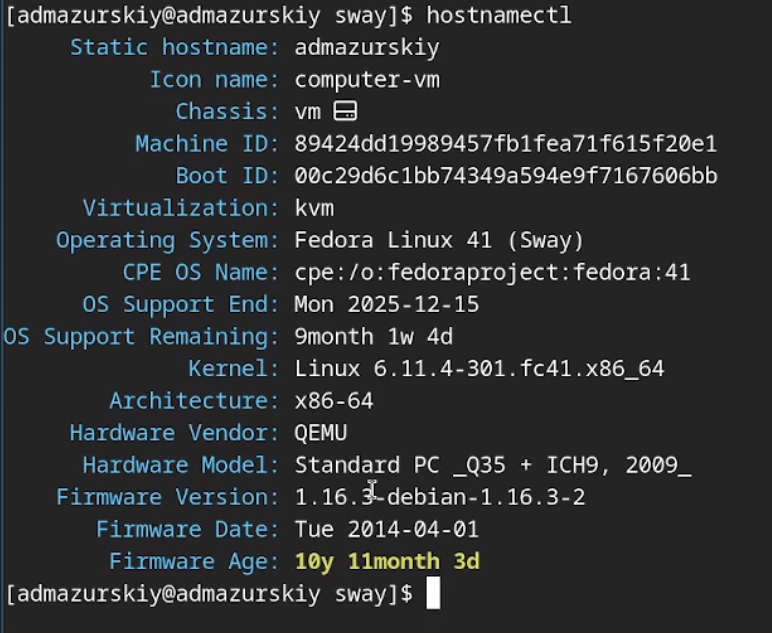
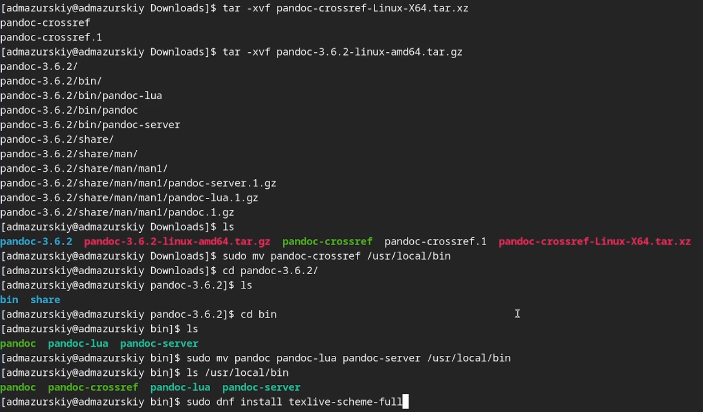
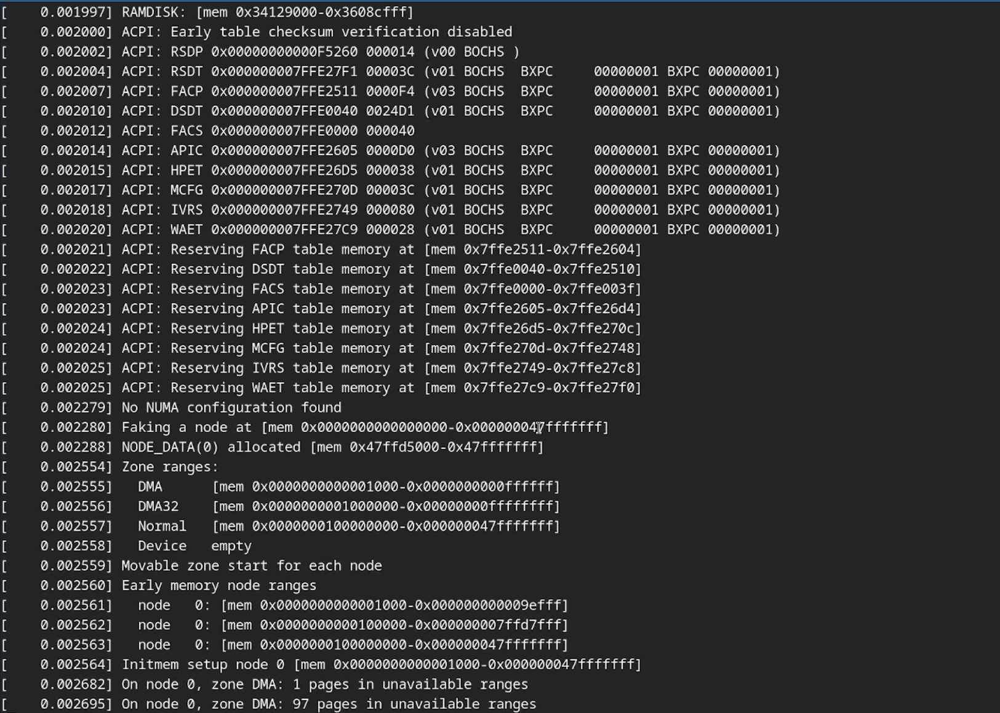

---
## Front matter
lang: ru-RU
title: Лабораторная работа №1
subtitle: Операционные системы
author:
  - Мазурский А. Д.
institute:
  - Российский университет дружбы народов, Москва, Россия
date: 06 марта 2025

## i18n babel
babel-lang: russian
babel-otherlangs: english

## Formatting pdf
toc: false
toc-title: Содержание
slide_level: 2
aspectratio: 169
section-titles: true
theme: metropolis
header-includes:
 - \metroset{progressbar=frametitle,sectionpage=progressbar,numbering=fraction}
---

# Информация

## Докладчик

:::::::::::::: {.columns align=center}
::: {.column width="70%"}

  * Мазурксий Александр Дмитриевич
  * Студент НКАбд-02-24
  * я саша
  * Российский университет дружбы народов
  * [1132242468@pfur.ru](mailto:1132242468@pfur.ru)

:::
::: {.column width="30%"}

:::
::::::::::::::

# Цель работы

Целью данной работы является приобретение практических навыков установки операционной системы на виртуальную машину, настройки минимально необходимых для дальнейшей работы сервисов.

# Задание

- Установка Linux на Qemu
- Установка необходимого ПО
- Первоначальная настройка ОС для дальнейшей работы

# Теоретическое введение

QEMU — свободная программа с открытым исходным кодом для эмуляции аппаратного обеспечения различных платформ.

Включает в себя эмуляцию процессоров Intel x86 и устройств ввода-вывода. Может эмулировать 80386, 80486, Pentium, Pentium Pro, AMD64 и другие x86-совместимые процессоры; ARM, MIPS, RISC-V, PowerPC, SPARC, SPARC64 и частично m68k.

Работает на Syllable, FreeBSD, OpenBSD, FreeDOS, Linux, Windows 9x, Windows 2000, Mac OS X, QNX[8][9][10], Android и др. 

# Выполнение лабораторной работы

Создаю виртальный жесткий диск и запускаю скачанный образ операционной системы.

{#fig:001 width=70%}

Через интерактивный установщик задаю базовые настройки для установки операционной системы.

{#fig:002 width=70%}

После установки ОС закрываю виртуальную машину и создаю скрипт для упрощенного запуска машины в дальнейшем.

{#fig:003 width=70%}

Скачиваю набор необходимых пакетов для работы с ОС. (рис. -@fig:004)

{#fig:004 width=70%}

Запускаю скрипт для автоматического обновления пакетов через пакетный менеджер dnf.

{#fig:005 width=70%}

Отключаю защиту SELinux, так как на данном курсе мы не будем рассматривать работу с ней.

{#fig:006 width=70%}

Настраиваю xkb, добавляю вторую раскладку клавиатуры с русским языком и задаю переключение на right ctrl.

{#fig:007 width=70%}

Проверяю корректность заданного имени для hostname. (рис. -@fig:008)

{#fig:008 width=70%}

Устанавливаю pandoc, pandoc-crossref, texlive для работы над отчетами для лабораторных работ.

{#fig:009 width=70%}

# Домашнее задание

Проверяю последовательность загрузки графического окружения командой dmesg | grep -i с указанием вывода желаемого нахождения.

{#fig:010 width=70%}

# Выводы

В ходе выполнения лабораторный работы приборел навыки установки виртуальной машины на Qemu, установил ряд пакетов и настроил ОС для дальнейшей работы на ней.

