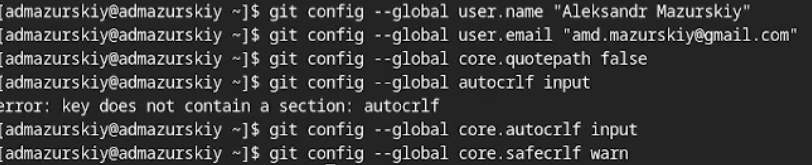
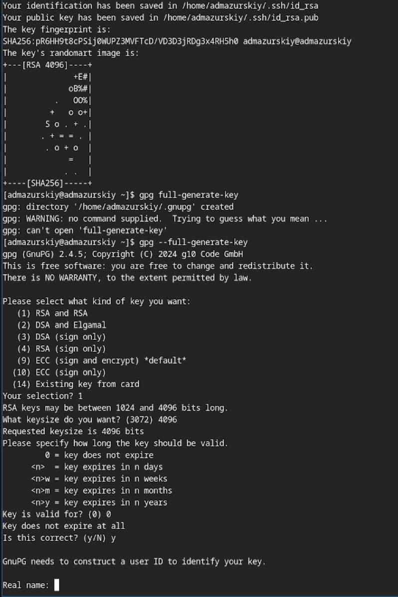
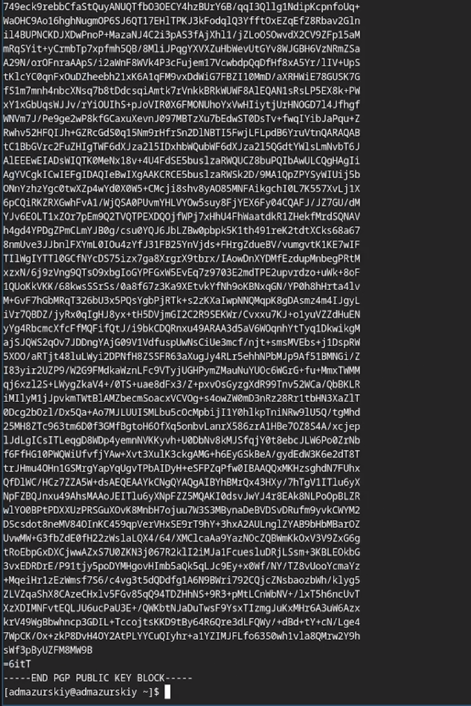
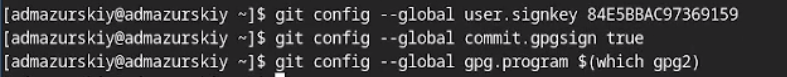
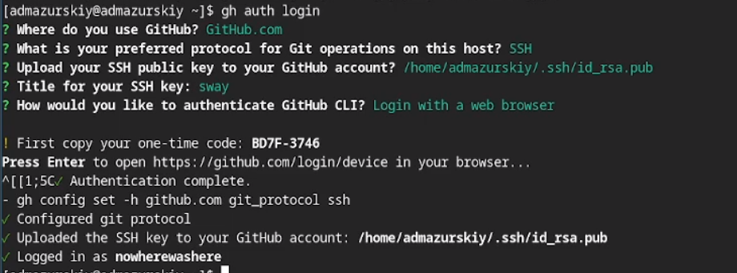
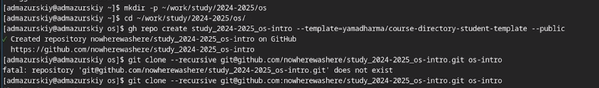
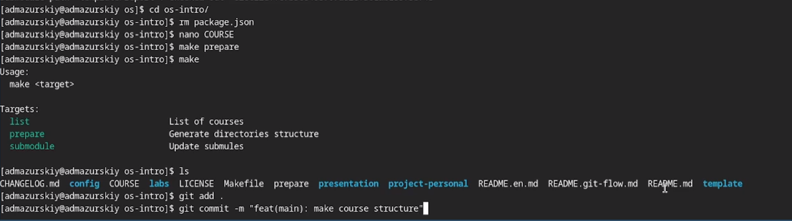

---
## Front matter
lang: ru-RU
title: Лабораторная работа №2
subtitle: Операционные системы
author:
  - Мазурский А. Д.
institute:
  - Российский университет дружбы народов, Москва, Россия
date: 06 марта 2025

## i18n babel
babel-lang: russian
babel-otherlangs: english

## Formatting pdf
toc: false
toc-title: Содержание
slide_level: 2
aspectratio: 169
section-titles: true
theme: metropolis
header-includes:
 - \metroset{progressbar=frametitle,sectionpage=progressbar,numbering=fraction}
---

# Информация

## Докладчик

:::::::::::::: {.columns align=center}
::: {.column width="70%"}

  * Мазурксий Александр Дмитриевич
  * Студент НКАбд-02-24
  * я саша
  * Российский университет дружбы народов
  * [1132242468@pfur.ru](mailto:1132242468@pfur.ru)

:::
::: {.column width="30%"}

:::
::::::::::::::

## Цель работы

Целью данной работы является изучение идеологии и применения средств контроля версий и освоение умения по работе с git.

## Задание

- базовую конфигурацию для работы с git.
- ключ SSH.
- ключ PGP.
- подписи git.
- на Github.
-  локальный каталог для выполнения заданий по предмету.

## Теоретическое введение

Системы контроля версий (Version Control System, VCS) применяются при работе нескольких человек над одним проектом. Обычно основное дерево проекта хранится в локальном или удалённом репозитории, к которому настроен доступ для участников проекта. При внесении изменений в содержание проекта система контроля версий позволяет их фиксировать, совмещать изменения, произведённые разными участниками проекта, производить откат к любой более ранней версии проекта, если это требуется.

В классических системах контроля версий используется централизованная модель, предполагающая наличие единого репозитория для хранения файлов. Выполнение большинства функций по управлению версиями осуществляется специальным сервером. Участник проекта (пользователь) перед началом работы посредством определённых команд получает нужную ему версию файлов. После внесения изменений, пользователь размещает новую версию в хранилище. При этом предыдущие версии не удаляются из центрального хранилища и к ним можно вернуться в любой момент. Сервер может сохранять не полную версию изменённых файлов, а производить так называемую дельта-компрессию — сохранять только изменения между последовательными версиями, что позволяет уменьшить объём хранимых данных.

## Выполнение лабораторной работы

Произвожу базовую настройку git.

{#fig:001 width=70%}

##

Создаю ssh и gpg ключи.

{#fig:002 width=70%}

##

Экспортирую gpg ключ для авторизации на github.

{#fig:003 width=70%}

##

Настраиваю автоматические подписи для коммитов.

{#fig:004 width=70%}

##

Авторизуюсь на github для работы через терминал.

{#fig:005 width=70%}

##

Создаю директорию курса по шаблонy.

{#fig:006 width=70%}

##

Настраиваю рабочую директорию.

{#fig:007 width=70%}

##

## Выводы

В результате выполнения данной лабораторной работы я приобрел необходимые навыки работы с гит, научился созданию репозиториев, gpg и ssh ключей, настроил каталог курса и авторизовался в gh.

