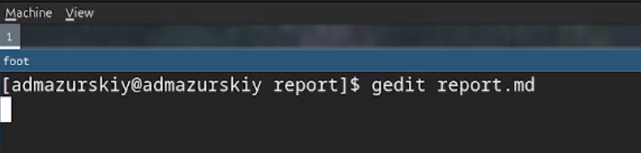
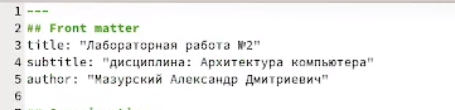
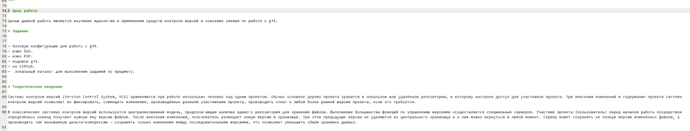
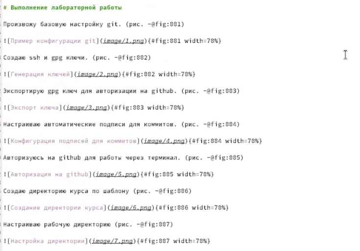

---
## Front matter
lang: ru-RU
title: Лабораторная работа №3
subtitle: Операционные системы
author:
  - Мазурский А. Д.
institute:
  - Российский университет дружбы народов, Москва, Россия
date: 06 марта 2025

## i18n babel
babel-lang: russian
babel-otherlangs: english

## Formatting pdf
toc: false
toc-title: Содержание
slide_level: 2
aspectratio: 169
section-titles: true
theme: metropolis
header-includes:
 - \metroset{progressbar=frametitle,sectionpage=progressbar,numbering=fraction}
---

# Информация

## Докладчик

:::::::::::::: {.columns align=center}
::: {.column width="70%"}

  * Мазурксий Александр Дмитриевич
  * Студент НКАбд-02-24
  * я саша
  * Российский университет дружбы народов
  * [1132242468@pfur.ru](mailto:1132242468@pfur.ru)

:::
::: {.column width="30%"}

:::
::::::::::::::

## Цель работы

Научиться оформлять отчёты с помощью легковесного языка разметки Markdown.

## Задание

1. Сделайте отчёт по предыдущей лабораторной работе в формате Markdown.
2. В качестве отчёта просьба предоставить отчёты в 3 форматах: pdf, docx и md (в архиве,
поскольку он должен содержать скриншоты, Makefile и т.д.)

## Теоретическое введение

Чтобы создать заголовок, используйте знак ( # ).
Чтобы задать для текста полужирное начертание, заключите его в двойные звездочки.
Чтобы задать для текста курсивное начертание, заключите его в одинарные звездочки.
Чтобы задать для текста полужирное и курсивное начертание, заключите его в тройные
звездочки.
Блоки цитирования создаются с помощью символа >.
Неупорядоченный (маркированный) список можно отформатировать с помощью звез-
дочек или тире.
Чтобы вложить один список в другой, добавьте отступ для элементов дочернего списка.
Упорядоченный список можно отформатировать с помощью соответствующих цифр.
Чтобы вложить один список в другой, добавьте отступ для элементов дочернего списка.
Синтаксис Markdown для встроенной ссылки состоит из части [link text] , представ-
ляющей текст гиперссылки, и части (file-name.md) – URL-адреса или имени файла,
на который дается ссылка.

##

Markdown поддерживает как встраивание фрагментов кода в предложение, так и их
размещение между предложениями в виде отдельных огражденных блоков. Огражденные
блоки кода — это простой способ выделить синтаксис для фрагментов кода. 
Внутритекстовые формулы делаются аналогично формулам LaTeX. 
Для обработки файлов в формате Markdown будем использовать Pandoc. Конкретно, нам понадобится программа pandoc ,
pandoc-citeproc https://github.com/jgm/pandoc/releases, pandoc-crossref
https://github.com/lierdakil/pandoc-crossref/releases.
Преобразовать файл README.md можно следующим образом:
1 pandoc README.md -o README.pdf
или так
1 pandoc README.md -o README.docx
Можно использовать следующий Makefile
1 FILES = $(patsubst %.md, %.docx, $(wildcard *.md))
2 FILES += $(patsubst %.md, %.pdf, $(wildcard *.md))

## Выполнение лабораторной работы

В рабочей директории курса открываю через текстовый редактор файл с шаблоном отчета.

{#fig:001 width=70%}

##

Указываю основную информацию о лабораторной работе.

{#fig:002 width=70%}

##

Формирую цель работы, задание и заполняю теоретическое введение.

{#fig:003 width=70%}

##

Описываю процесс выполнения лабораторной работы.

{#fig:004 width=70%}

## Выводы

В ходе выполнения данной лабораторной работы я научился оформлять отчёты с помощью легковесного языка разметки Markdown.
