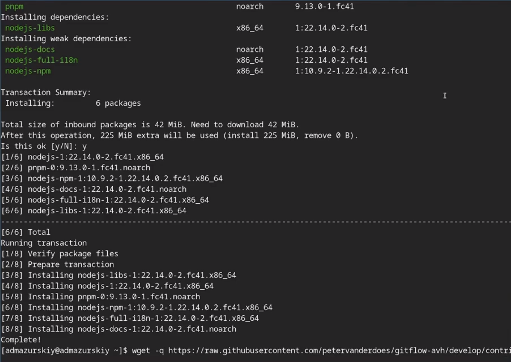
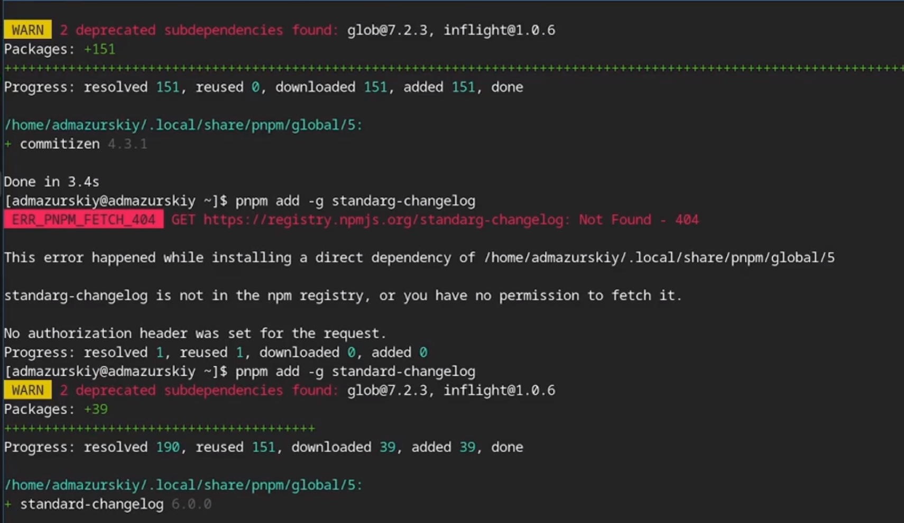
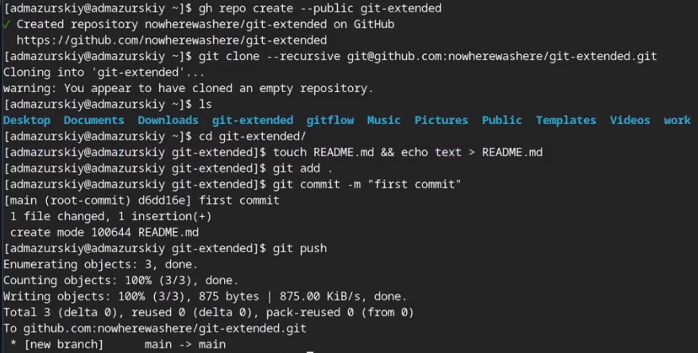
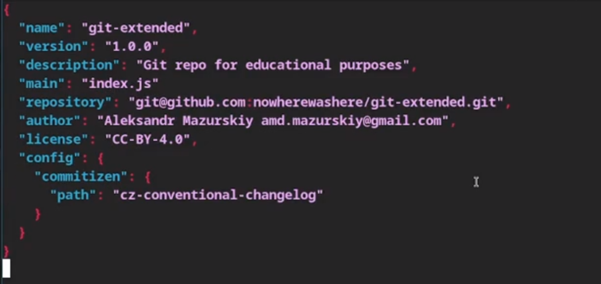
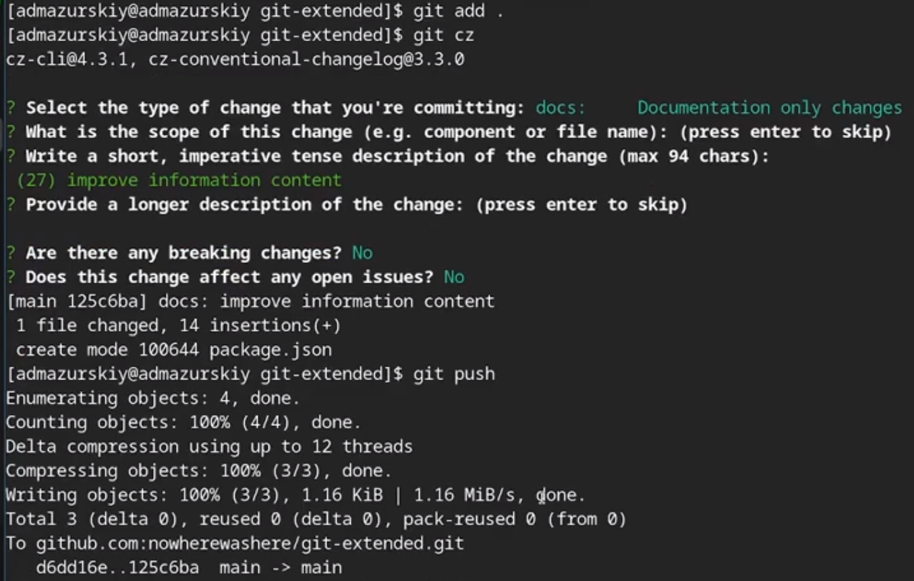
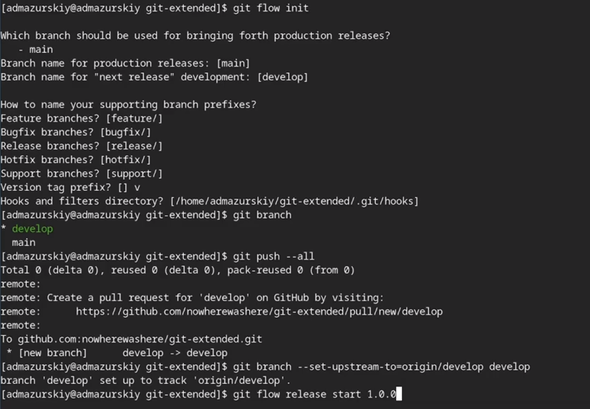
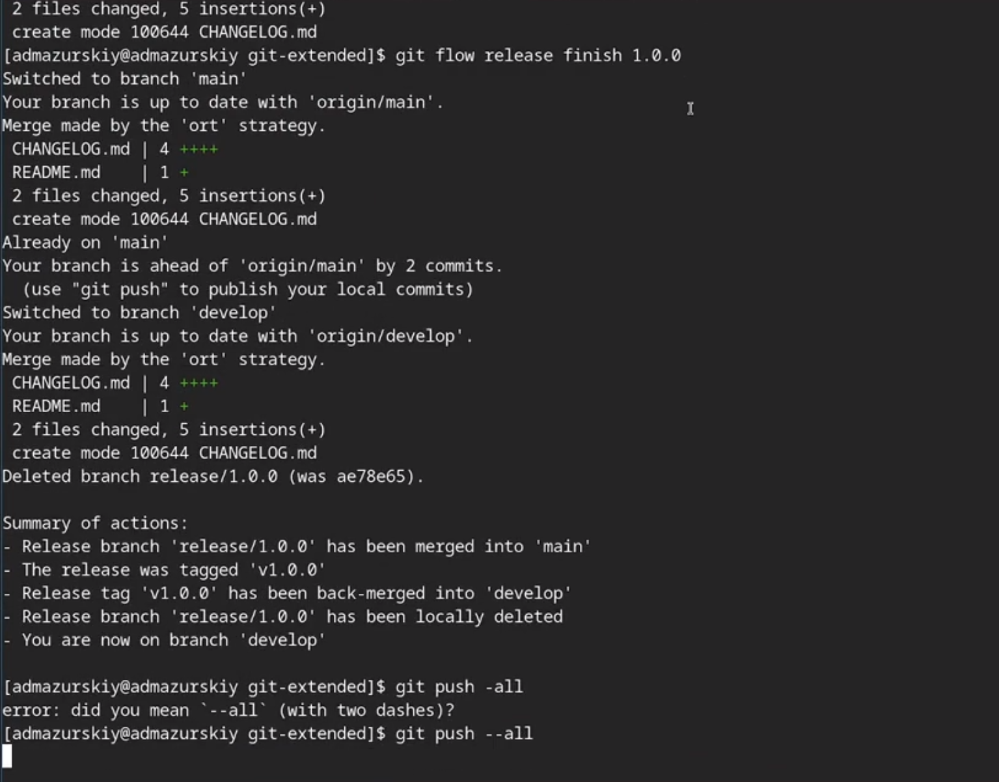
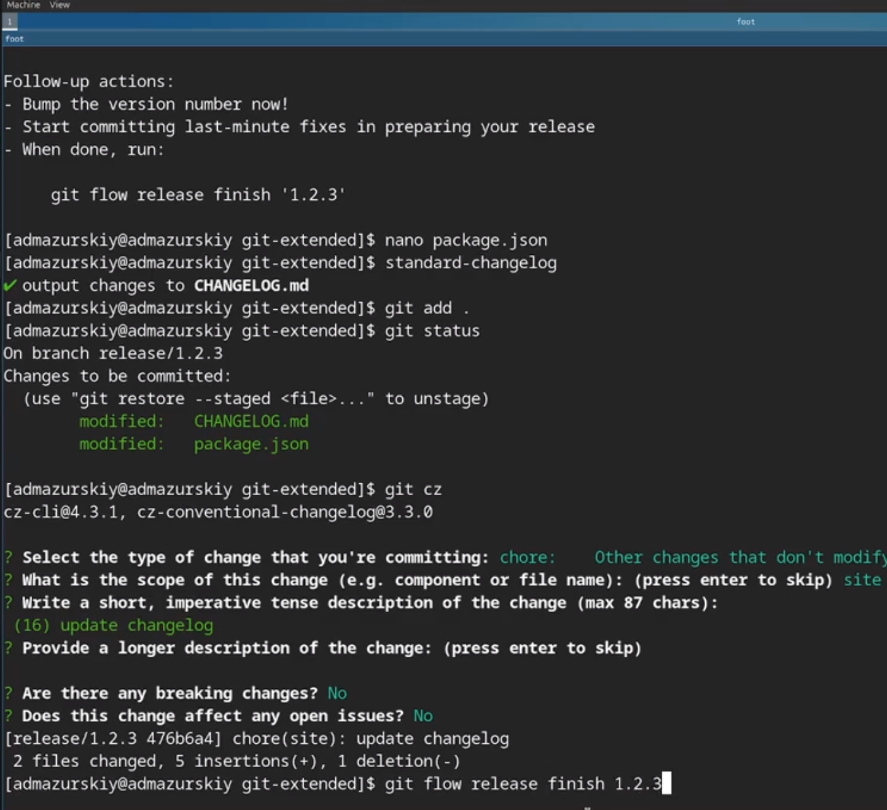

---
## Front matter
lang: ru-RU
title: Лабораторная работа №4
subtitle: Операционные системы
author:
  - Мазурский А. Д.
institute:
  - Российский университет дружбы народов, Москва, Россия
date: 06 марта 2025

## i18n babel
babel-lang: russian
babel-otherlangs: english

## Formatting pdf
toc: false
toc-title: Содержание
slide_level: 2
aspectratio: 169
section-titles: true
theme: metropolis
header-includes:
 - \metroset{progressbar=frametitle,sectionpage=progressbar,numbering=fraction}
---

# Информация

## Докладчик

:::::::::::::: {.columns align=center}
::: {.column width="70%"}

  * Мазурксий Александр Дмитриевич
  * Студент НКАбд-02-24
  * я саша
  * Российский университет дружбы народов
  * [1132242468@pfur.ru](mailto:1132242468@pfur.ru)

:::
::: {.column width="30%"}

:::
::::::::::::::

## Цель работы

Получение навыков продвинутой работы с репозиториями git и релизами.

## Задание

1. Выполнить работу для тестового репозитория.
2. Преобразовать рабочий репозиторий в репозиторий с git-flow и conventional commits.

## Теоретическое введение

Gitflow Workflow опубликована и популяризована Винсентом Дриссеном. Gitflow Workflow предполагает выстраивание строгой модели ветвления с учётом выпуска проекта. Данная модель отлично подходит для организации рабочего процесса на основе релизов.v Работа по модели Gitflow включает создание отдельной ветки для исправлений ошибок в рабочей среде. 

Семантическое версионирование описывается в манифесте семантического версионирования. Кратко его можно описать следующим образом: Версия задаётся в виде кортежа МАЖОРНАЯ_ВЕРСИЯ.МИНОРНАЯ_ВЕРСИЯ.ПАТЧ. Номер версии следует увеличивать: МАЖОРНУЮ версию, когда сделаны обратно несовместимые изменения API. МИНОРНУЮ версию, когда вы добавляете новую функциональность, не нарушая обратной совместимости. ПАТЧ-версию, когда вы делаете обратно совместимые исправления. Дополнительные обозначения для предрелизных и билд-метаданных возможны как дополнения к МАЖОРНАЯ.МИНОРНАЯ.ПАТЧ формату.

Спецификация Conventional Commits: Соглашение о том, как нужно писать сообщения commit'ов. Совместимо с SemVer. Даже вернее сказать, сильно связано с семантическим версионированием. Регламентирует структуру и основные типы коммитов.

## Выполнение лабораторной работы

Устанавливаю nodejs, пакетный менеджер для него pnpm и gitflow.

{#fig:001 width=70%}

##

Устаналиваю через pnpm commitizen и standard-changelog.

{#fig:002 width=70%}

##

Создаю новый репозиторий и делаю там первый коммит.

{#fig:003 width=70%}

##

Инициализирую и конфигурирую общепринятые коммиты в созданной директории через редактирование package.json.

{#fig:004 width=70%}

##

Делаю снимок измененний, создаю коммит и отправляю на удаленный репозиторий.

{#fig:005 width=70%}

##

Инициализирую в репозитории git flow и создаю 1 релиз в только что созданной ветке develop.

{#fig:006 width=70%}

##

Создаю список изменений через standard changelog, заканчиваю релиз и выгружаю на удаленный репозиторий изменения.

{#fig:007 width=70%}

##

Инициализирую ветку feature для работы над новой функциональностью, готовлю релиз и загружаю на github.

{#fig:008 width=70%}

## Выводы

В ходе выполнения лабораторный работы я получил навыки правильной работы с репозиториями git.

