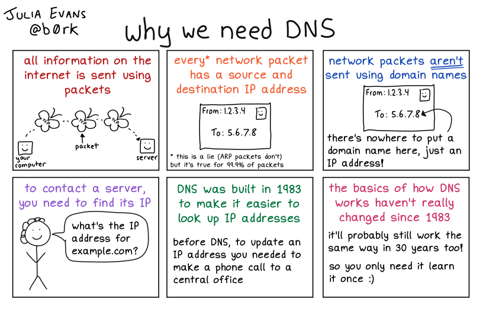
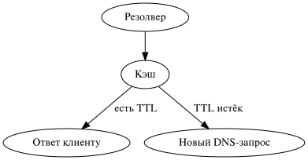
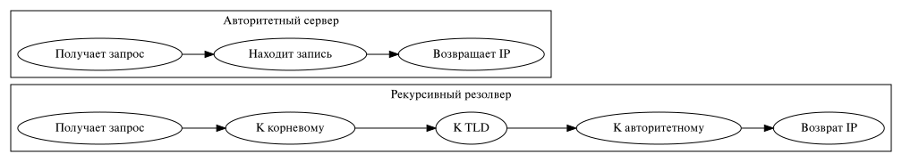

---
## Front matter
lang: ru-RU
title: Архитектура и функционирование DNS
subtitle: Архитектура компьютеров и операционные системы
author:
- Мазурский Александр Дмитриевич
institute:
- Российский университет дружбы народов, Москва, Россия

date: 06 марта 2025

## i18n babel
babel-lang: russian
babel-otherlangs: english

## Formatting pdf
toc: false
toc-title: Содержание
slide_level: 2
aspectratio: 169
section-titles: true
theme: metropolis
header-includes:
- \metroset{progressbar=frametitle,sectionpage=progressbar,numbering=fraction}
---

## Докладчик

:::::::::::::: {.columns align=center}
::: {.column width="70%"}

- Мазурский Александр Дмитриевич
- Студент группы НКАбд-02-24
- Студенческий билет №1132242468
- Российский университет дружбы народов
- [GitHub](https://github.com/nowherewashere/)

:::
::: {.column width="30%"}

:::
::::::::::::::

## Введение

- DNS — это основа навигации в Интернете
- Он позволяет преобразовывать доменные имена в IP-адреса, понятные компьютерам

{ width=40% }

## Назначение DNS

- Упрощает доступ к онлайн-ресурсам через понятные доменные имена
- Снижает нагрузку на пользователя и упрощает работу приложений

{ width=70% }

## Рекурсивный DNS-запрос

- Клиент отправляет запрос рекурсивному резолверу
- Резолвер запрашивает данные у других серверов до получения IP-ответа

{ width=70% }

## Принцип работы DNS-запроса

## Зоны DNS и делегирование

- Зона DNS — область пространства имён, управляемая администратором
- Делегирование — передача части зоны другому серверу

{ width=150px }

## DNS-записи

- **A** — IPv4 адрес
- **AAAA** — IPv6 адрес
- **CNAME** — каноническое имя
- **MX** — почтовый сервер
- **NS** — серверы имён зоны

## DNS-кеширование

- Резолвер сохраняет IP-ответы на время (TTL)
- Уменьшает задержки и нагрузку на сеть

{ width=250px }

## Отличие рекурсивного и авторитетного DNS

## Заключение

- DNS — важнейший компонент сети, обеспечивающий понятную маршрутизацию
- Использует иерархическую архитектуру и кэширование для эффективности
- Понимание зон и записей критично для системной и сетевой работы

## Список литературы{.unnumbered}

1. https://bunny.net/academy/dns/what-is-a-dns-and-recursive-query/
2. https://bunny.net/academy/dns/what-are-dns-zones-and-dns-records/
3. https://bunny.net/academy/dns/what-is-recursive-dns-rdns/

