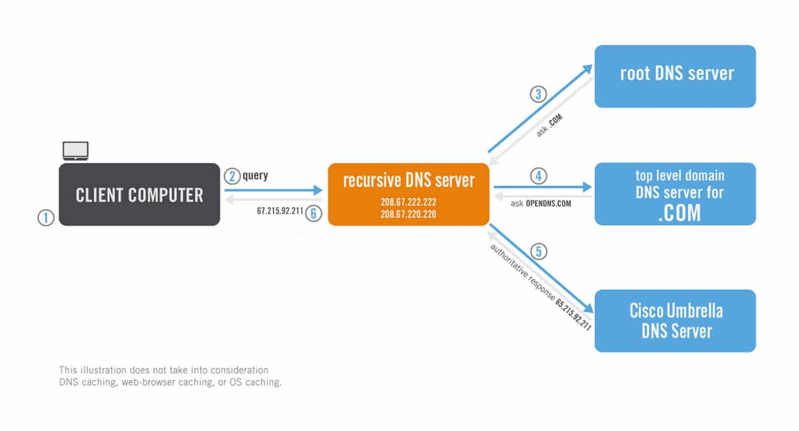
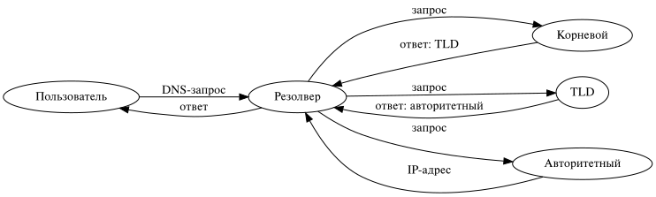
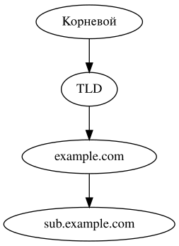
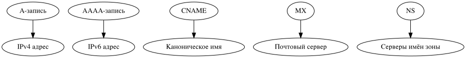

---
## Front matter
title: "Архитектура и функционирование DNS"
subtitle: "Архитектура компьютеров и операционные системы"
author: "Мазурский Александр Дмитриевич"

## Generic otions
lang: ru-RU
toc-title: "Содержание"

## Bibliography
bibliography: bib/cite.bib
csl: pandoc/csl/gost-r-7-0-5-2008-numeric.csl

## Pdf output format
toc: true # Table of contents
toc-depth: 2
lof: true # List of figures
lot: true # List of tables
fontsize: 12pt
linestretch: 1.5
papersize: a4
documentclass: scrreprt
## I18n polyglossia
polyglossia-lang:
  name: russian
  options:
	- spelling=modern
	- babelshorthands=true
polyglossia-otherlangs:
  name: english
## I18n babel
babel-lang: russian
babel-otherlangs: english
## Fonts
mainfont: IBM Plex Serif
romanfont: IBM Plex Serif
sansfont: IBM Plex Sans
monofont: IBM Plex Mono
mathfont: STIX Two Math
mainfontoptions: Ligatures=Common,Ligatures=TeX,Scale=0.94
romanfontoptions: Ligatures=Common,Ligatures=TeX,Scale=0.94
sansfontoptions: Ligatures=Common,Ligatures=TeX,Scale=MatchLowercase,Scale=0.94
monofontoptions: Scale=MatchLowercase,Scale=0.94,FakeStretch=0.9
mathfontoptions:
## Biblatex
biblatex: true
biblio-style: "gost-numeric"
biblatexoptions:
  - parentracker=true
  - backend=biber
  - hyperref=auto
  - language=auto
  - autolang=other*
  - citestyle=gost-numeric
## Pandoc-crossref LaTeX customization
figureTitle: "Рис."
tableTitle: "Таблица"
listingTitle: "Листинг"
lofTitle: "Список иллюстраций"
lotTitle: "Список таблиц"
lolTitle: "Листинги"
## Misc options
indent: true
header-includes:
  - \usepackage{indentfirst}
  - \usepackage{float} # keep figures where there are in the text
  - \floatplacement{figure}{H} # keep figures where there are in the text
---

# Введение

- DNS — это основа навигации в Интернете
- Он позволяет преобразовывать доменные имена в IP-адреса, понятные компьютерам

{ width=40% }

# Назначение DNS

- Упрощает доступ к онлайн-ресурсам через понятные доменные имена
- Снижает нагрузку на пользователя и упрощает работу приложений

{ width=70% }

# Рекурсивный DNS-запрос

- Клиент отправляет запрос рекурсивному резолверу
- Резолвер запрашивает данные у других серверов до получения IP-ответа

{ width=70% }

# Принцип работы DNS-запроса

# Зоны DNS и делегирование

- Зона DNS — область пространства имён, управляемая администратором
- Делегирование — передача части зоны другому серверу

{ width=150px }

# DNS-записи

- **A** — IPv4 адрес
- **AAAA** — IPv6 адрес
- **CNAME** — каноническое имя
- **MX** — почтовый сервер
- **NS** — серверы имён зоны

# DNS-кеширование

- Резолвер сохраняет IP-ответы на время (TTL)
- Уменьшает задержки и нагрузку на сеть

{ width=250px }

# Отличие рекурсивного и авторитетного DNS

# Заключение

- DNS — важнейший компонент сети, обеспечивающий понятную маршрутизацию
- Использует иерархическую архитектуру и кэширование для эффективности
- Понимание зон и записей критично для системной и сетевой работы

# Список литературы{.unnumbered}

1. https://bunny.net/academy/dns/what-is-a-dns-and-recursive-query/
2. https://bunny.net/academy/dns/what-are-dns-zones-and-dns-records/
3. https://bunny.net/academy/dns/what-is-recursive-dns-rdns/
