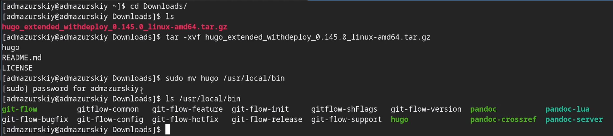
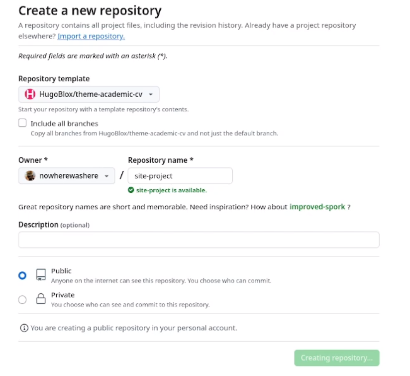
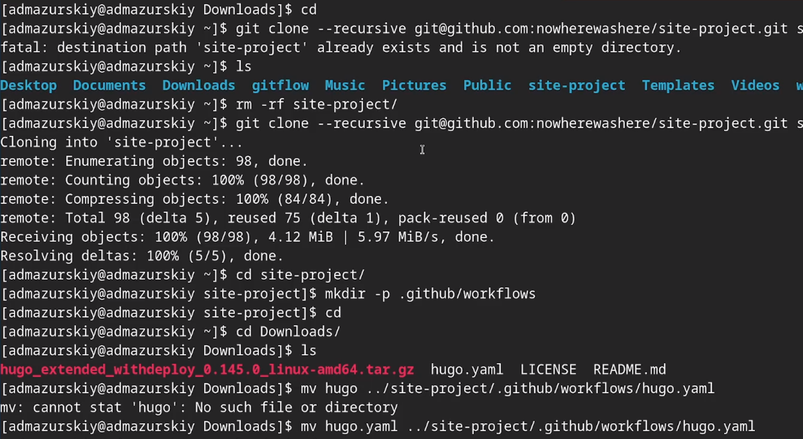
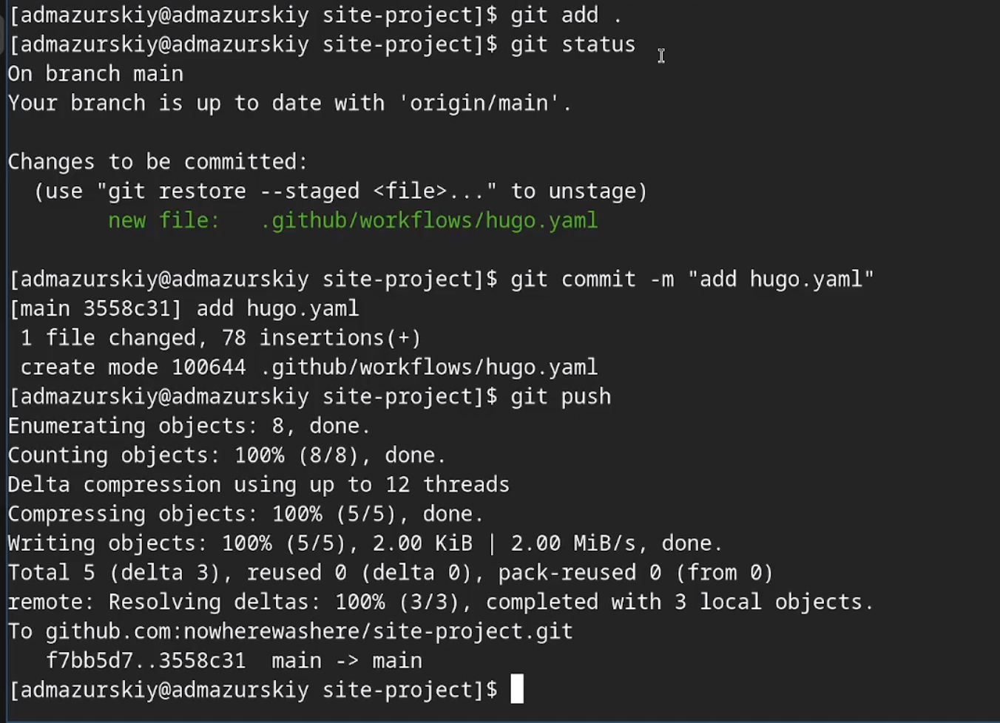
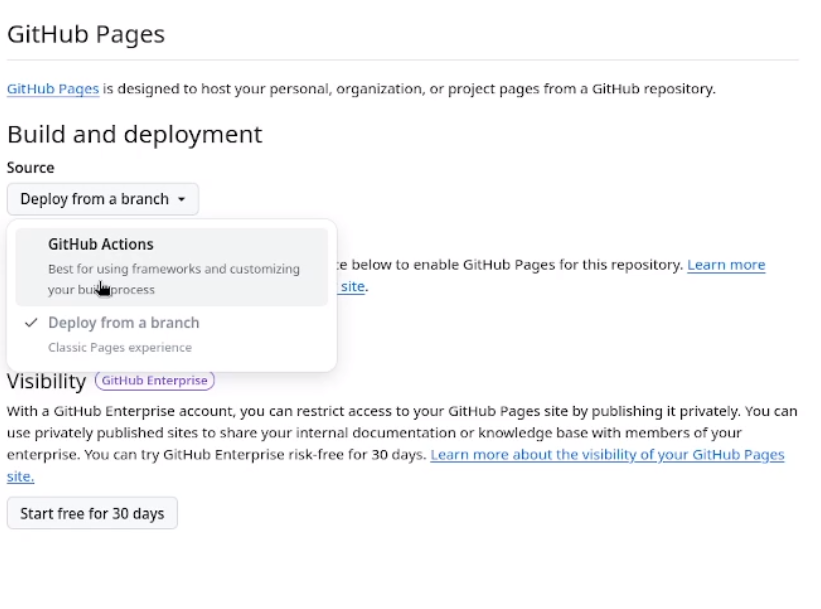
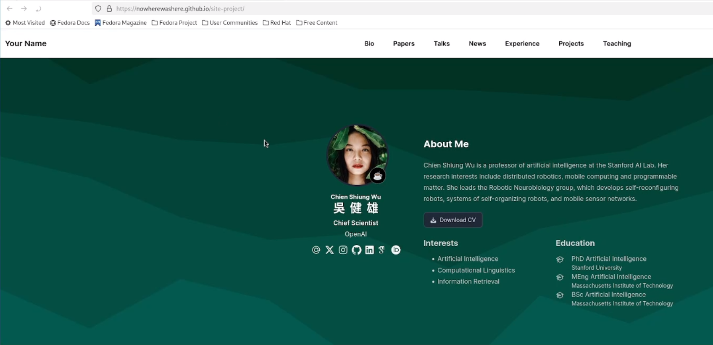

---
## Front matter
lang: ru-RU
title: Индивидуальный проект 1 этап
subtitle: Операционные системы
author:
  - Мазурский А. Д.
institute:
  - Российский университет дружбы народов, Москва, Россия
date: 06 марта 2025

## i18n babel
babel-lang: russian
babel-otherlangs: english

## Formatting pdf
toc: false
toc-title: Содержание
slide_level: 2
aspectratio: 169
section-titles: true
theme: metropolis
header-includes:
 - \metroset{progressbar=frametitle,sectionpage=progressbar,numbering=fraction}
---

# Информация

## Докладчик

:::::::::::::: {.columns align=center}
::: {.column width="70%"}

  * Мазурксий Александр Дмитриевич
  * Студент НКАбд-02-24
  * я саша
  * Российский университет дружбы народов
  * [1132242468@pfur.ru](mailto:1132242468@pfur.ru)

:::
::: {.column width="30%"}

:::
::::::::::::::

## Цель работы

Научиться размещать сайт на Github pages. Выполнить первый этап индивидуального проекта.

## Задание

1. Установка необходимого ПО
2. Скачивание шаблона темы сайта
3. Размещение его на хостинге Git
4. Установка параметра для URL сайта
5. Размещение загатовки сайта на Github pages

## Выполнение индивидуального проекта

Устанавливаю hugo на свою виртуальную машину и переношу исполняемый файл в директорию с пакетами. 

{#fig:001 width=70%}

##

Создаю свой репозиторий для будущего сайта, используя шаблон. 

{#fig:002 width=70%}

##

Клонирую репозиторий на свою машину и загружаю туда конфигурационный файл для сайта.

{#fig:003 width=70%}

##

Делаю снимок изменений, создаю коммит и отправляю изменения на github.

{#fig:004 width=70%}

##

В настройках репозитория указываю github actions.

{#fig:005 width=70%}

##

Проверяю работоспособность сайта.

{#fig:006 width=70%}

## Выводы

Мы научились размещать сайт на Github pages, выполнили первый этап индивидуального проекта.
