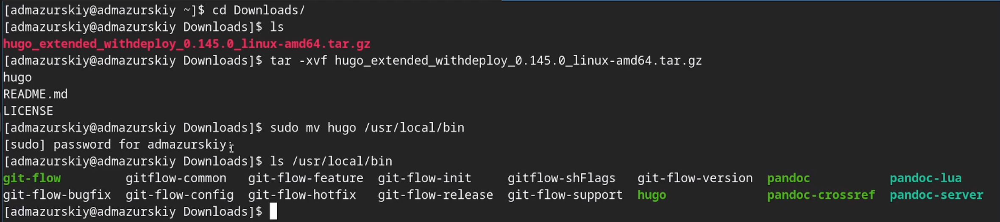
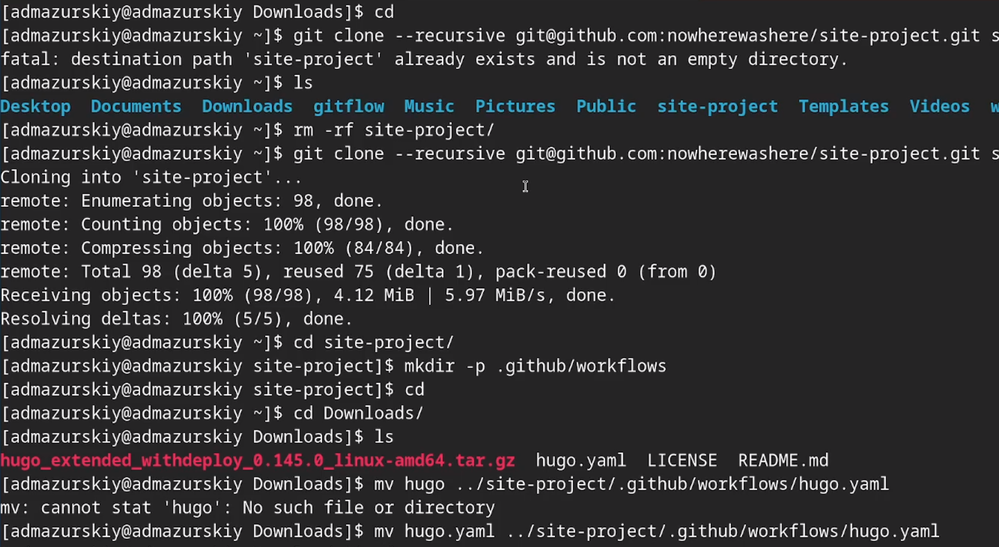
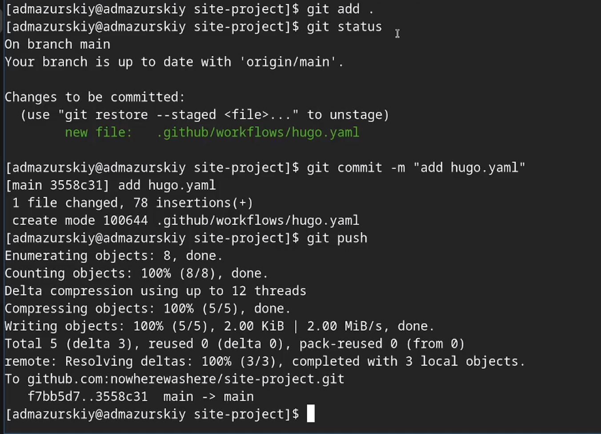
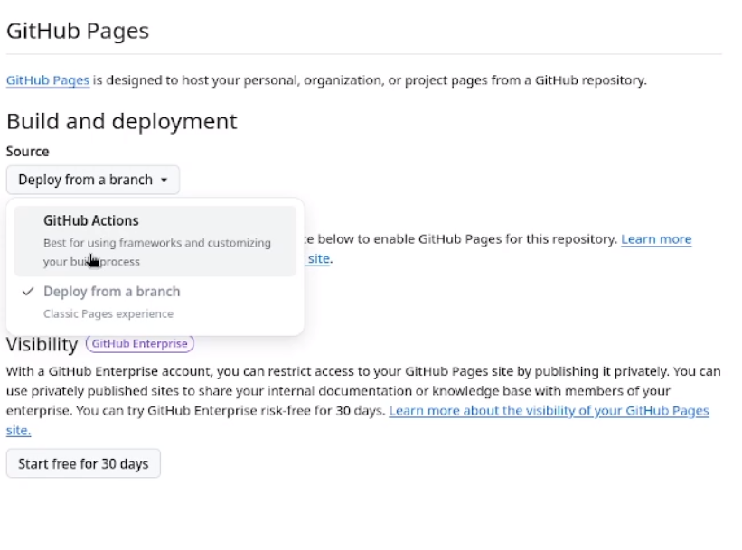

---
## Front matter
title: "Индивидуальный проект 1 этап"
subtitle: "дисциплина: Архитектура компьютера"
author: "Мазурский Александр Дмитриевич"

## Generic otions
lang: ru-RU
toc-title: "Содержание"

## Bibliography
bibliography: bib/cite.bib
csl: pandoc/csl/gost-r-7-0-5-2008-numeric.csl

## Pdf output format
toc: true # Table of contents
toc-depth: 2
lof: true # List of figures
lot: true # List of tables
fontsize: 12pt
linestretch: 1.5
papersize: a4
documentclass: scrreprt
## I18n polyglossia
polyglossia-lang:
  name: russian
  options:
	- spelling=modern
	- babelshorthands=true
polyglossia-otherlangs:
  name: english
## I18n babel
babel-lang: russian
babel-otherlangs: english
## Fonts
mainfont: IBM Plex Serif
romanfont: IBM Plex Serif
sansfont: IBM Plex Sans
monofont: IBM Plex Mono
mathfont: STIX Two Math
mainfontoptions: Ligatures=Common,Ligatures=TeX,Scale=0.94
romanfontoptions: Ligatures=Common,Ligatures=TeX,Scale=0.94
sansfontoptions: Ligatures=Common,Ligatures=TeX,Scale=MatchLowercase,Scale=0.94
monofontoptions: Scale=MatchLowercase,Scale=0.94,FakeStretch=0.9
mathfontoptions:
## Biblatex
biblatex: true
biblio-style: "gost-numeric"
biblatexoptions:
  - parentracker=true
  - backend=biber
  - hyperref=auto
  - language=auto
  - autolang=other*
  - citestyle=gost-numeric
## Pandoc-crossref LaTeX customization
figureTitle: "Рис."
tableTitle: "Таблица"
listingTitle: "Листинг"
lofTitle: "Список иллюстраций"
lotTitle: "Список таблиц"
lolTitle: "Листинги"
## Misc options
indent: true
header-includes:
  - \usepackage{indentfirst}
  - \usepackage{float} # keep figures where there are in the text
  - \floatplacement{figure}{H} # keep figures where there are in the text
---

# Цель работы

Научиться размещать сайт на Github pages. Выполнить первый этап индивидуального проекта.

# Задание

1. Установка необходимого ПО
2. Скачивание шаблона темы сайта
3. Размещение его на хостинге Git
4. Установка параметра для URL сайта
5. Размещение загатовки сайта на Github pages

# Выполнение индивидуального проекта

Устанавливаю hugo на свою виртуальную машину и переношу исполняемый файл в директорию с пакетами. (рис. -@fig:001)

{#fig:001 width=70%}

Создаю свой репозиторий для будущего сайта, используя шаблон. (рис. -@fig:002)

{#fig:002 width=70%}

Клонирую репозиторий на свою машину и загружаю туда конфигурационный файл для сайта. (рис. -@fig:003)

{#fig:003 width=70%}

Делаю снимок изменений, создаю коммит и отправляю изменения на github. (рис. -@fig:004)

{#fig:004 width=70%}

В настройках репозитория указываю github actions. (рис. -@fig:005)

{#fig:005 width=70%}

Проверяю работоспособность сайта. (рис. -@fig:006)

{#fig:006 width=70%}

# Выводы

Мы научились размещать сайт на Github pages, выполнили первый этап индивидуального проекта.

# Список литературы{.unnumbered}

::: {#refs}
:::
