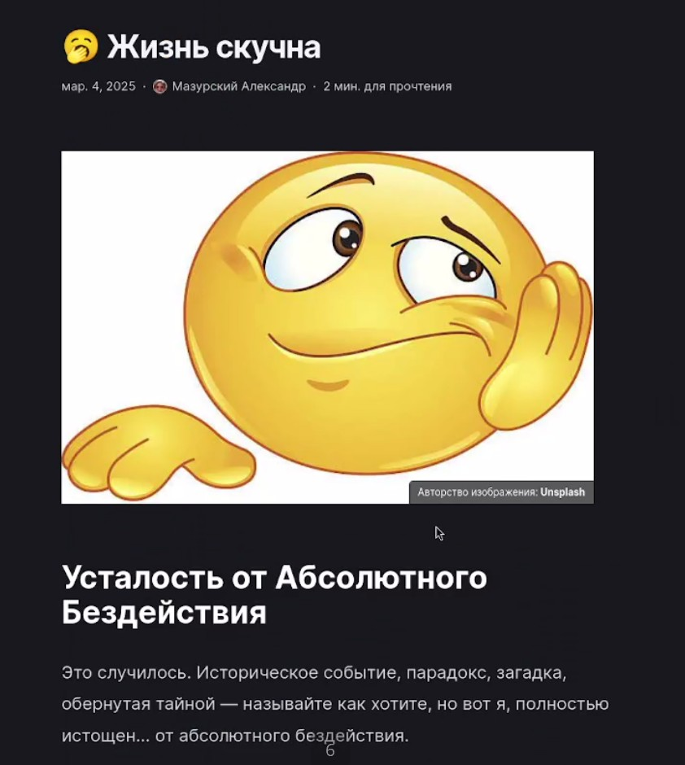

---
## Front matter
lang: ru-RU
title: Индивидуальный проект 6 этап
subtitle: Операционные системы
author:
  - Мазурский А. Д.
institute:
  - Российский университет дружбы народов, Москва, Россия
date: 06 марта 2025

## i18n babel
babel-lang: russian
babel-otherlangs: english

## Formatting pdf
toc: false
toc-title: Содержание
slide_level: 2
aspectratio: 169
section-titles: true
theme: metropolis
header-includes:
 - \metroset{progressbar=frametitle,sectionpage=progressbar,numbering=fraction}
---

# Информация

## Докладчик

:::::::::::::: {.columns align=center}
::: {.column width="70%"}

  * Мазурксий Александр Дмитриевич
  * Студент НКАбд-02-24
  * я саша
  * Российский университет дружбы народов
  * [1132242468@pfur.ru](mailto:1132242468@pfur.ru)

:::
::: {.column width="30%"}

:::
::::::::::::::

## Цель работы

1. Сделать поддержку английского и русского языков.
2. Разместить элементы сайта на обоих языках.
3. Разместить контент на обоих языках.
4. Сделать пост по прошедшей неделе.
5. Добавить пост на тему по выбору (на двух языках).

## Выполнение индивидуального проекта

Меняю настройки для отображения двух языков и добавляю контент на русском языке. 

{#fig:001 width=70%}

##

Проверяю на сайте отображения русского языка. 

{#fig:002 width=70%}

##

Проверяю отображение постов на русском языке. 

{#fig:003 width=70%}

##

Загружаю изменения на гитхаб 

{#fig:004 width=70%}

## Выводы

Мы продолжили работу с сайтом, разместили двуязычный сайт на Github.
